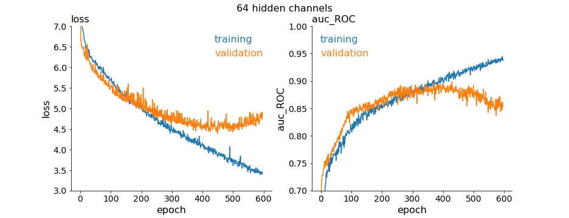
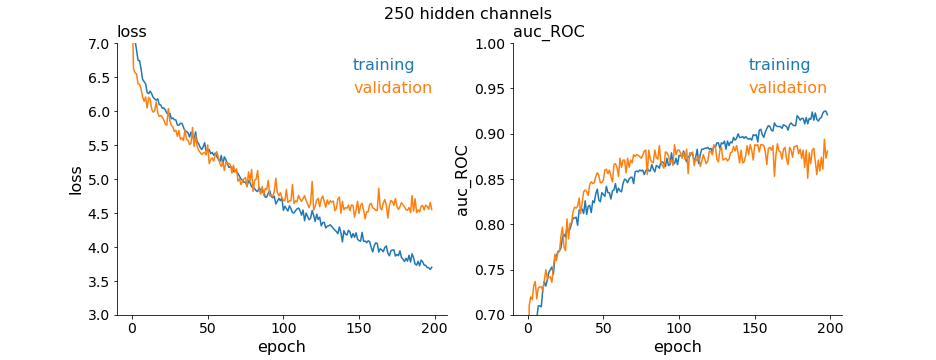
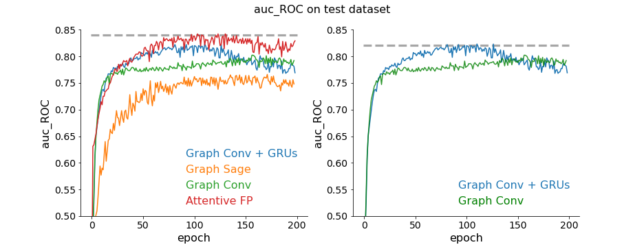
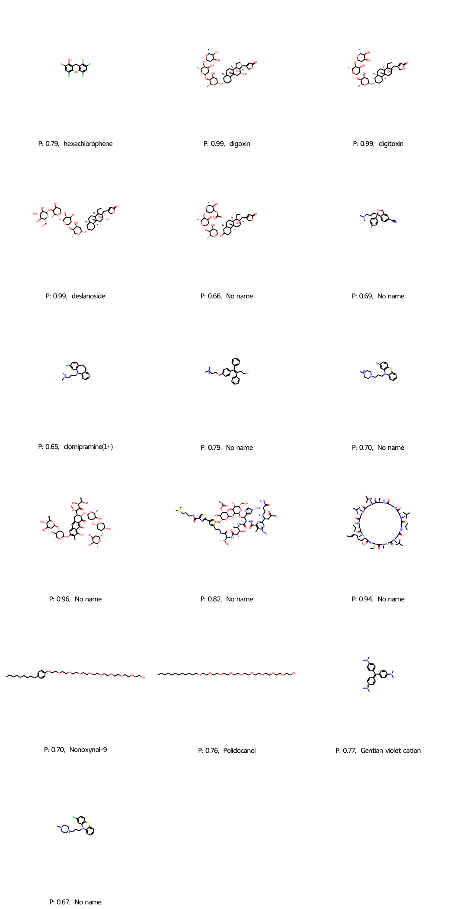

# Virtual Drug Screening with Graph NNs (for Covid-19)
This project showcases the use of Graph Neural Networks for a virtual screening of drug candidates for Covid-19. The Attentive FP architecture used here achieves SOTA performance on classification of drugs as being active against Covid-19. The auc_ROC score of 0.84 is on par with the results achieved on benchmark datasets, e.g.: activity against HIV. Benchmarks and comparisons to other ML methods can be found here:
https://pubs.acs.org/doi/10.1021/acs.jmedchem.9b00959
https://jcheminf.biomedcentral.com/articles/10.1186/s13321-020-00479-8.

The dataset processing and Graph NN architectures from this repo could be used for any other molecular dataset, e.g. activity against different disease or other molecular classification task.

## 1. The Covid-19 dataset
Covid-19 dataset was built in January 2022 by using a PubChem query:
https://pubchem.ncbi.nlm.nih.gov/#query=covid-19&tab=bioassay

Individual experimental results of bioassays were merged into one file resulting in over 600k entries with activity outcomes:

| PUBCHEM_ACTIVITY_OUTCOME | # molecules |
|--------------------------|-----------|
| Inactive                  |  622798 |
| Unspecified               |   10289 |
| Inconclusive              |    7606 |
| Active                    |    3042 |  

The processing of a dataset involved: 
- removing of invalid entries
- disregarding of Unspecified and Inconclusive outcomes
- binary encoding of activity
- removing of duplicates
- downloading SMILES from PubChem by CID identifier using a bulk query (PubChem PUG-REST API is too slow!)
- merging SMILES with activity information in a two-column (SMILES, Activity) csv file with over 300k entries

The dataset was divided in train (70%), validation (10%) and test (20%) datasets with ratios between active and inactive molecules being equal in each dataset.

The rest of processing is in the train notebook and includes transformation of SMILES to Graphs and encoding. The train notebook can be used with arbitrary CSV with SMILES and binary encoded column.  

## 2. Graph NN architectures (PyTorch Geometric)
I tested few architectures for comparison:
- Graph Sage model was used with 200 channels and 4 layers
- Graph Conv model was used with 200 channels and 3 layers
- "Conv-GRU" is my own design based on Attentive FP. It had 3 Graph Convolution layers and 3 GRU layers stacked in between Convolutions and 200 channels
- Attentive FP was used with 64 or 250 channels.

## 3. The Attentive FP architecture
The PyTorch Geometric`s implementation of AttentiveFP and atomic (node) and bond (edge) encoding was used. It is consistent with original publication:
https://pubs.acs.org/doi/10.1021/acs.jmedchem.9b00959

I used the code examples for a regression task from PyTorch Geometric`s github and MoleculeNet Dataset, and adjusted them to the classification task with a custom dataset:
https://github.com/pyg-team/pytorch_geometric/tree/master/examples

## 4. Additional tweaks
The performance of the network was poor due to the huge imbalance in the dataset, around 230k of inactive molecules vs. 1k of active compounds. In order to achieve SOTA performance the loss function had to be weighted. Few chemical elements were also added to the atomic encoding as new features resulting in atomic (node) encoding of 44 input dimensions.

## 5. Training and performance 
### 5.1 SOTA network:
Variants of AttentiveFP with 64 (small) and 250 (large) hidden_channels (fingerprint dimensions) were tested. Other hyper-parameters of the network were fixed to: 4 layers (for atomic embedding) and 3 timesteps (for molecular embedding) with dropout of 0.2. Both achieved auc_ROC of 0.83-0.84 on test dataset with the difference being that large network converged almost 2 times faster and had slightly better auc_ROC scores. 

### 5.2 Baseline and "Conv-GRU" architecture:
I used Graph Sage (4 layers) and Graph Conv (3 layers) architectures as a baseline which had moderate performance, below 0.8. Interestingly, GraphConv with 3 layers and 3 GRU layers stacked in between second and third Conv layer (Conv-GRU) achieved only slightly worse result (auc_ROC 0.82) than Attentive FP even though it had less layers, less hidden channels, did not use edge (bond) features nor computationally expensive Attention mechanism. It should be noted, however, that transformation of Graph to the Fourier space and GRU layers are still quite expensive in a Conv-GRU architecture.

Fig 2. Plot with auc_ROC scores for the test dataset. (left) Comparison of performance for all tested networks. The gray line indicates auc_ROC of 0.84, (right) Comparison of "Conv-GRU" to a standard Conv network. The gray line indicates auc_ROC of 0.82.

## 6. Virtual Screening with Attentive FP
The Drug Screening was performed with Virtual_Screening.ipynb. Below are drug candidates obtained by screening of the FDA-approved molecules from ClinTox dataset. 

Among medications which are not meant for oral administration (topical antiseptics) four classes of drugs were found to be potentially active against Covid-19: glicosides, antypsychotic drugs, cyclosporin and anticancer drugs.

Three heart-protecting glicosides were scored with high probability (P=0.99): digoxin, digitoxin and deslanozid.

Antipsychotics: chlorpromazine, clomipramine and similar scored in the range from 0.65 to 0.8. 

Cyclosporin (the large cyclic molecule) scored 0.94.

Anti-cancer/antineoplastic drugs: Bleomycin and Mithramicin scored high: 0.96 and 0.82 respectively.

Fig 3. Drug screening results. Molecules are labeled with a probability (P) which can be interpreted as Covid-19 drug-likeliness predicted by the network and name if exact same SMILES could be found on PubChem. Results are shown for P > 0.6.   

## 7. Analysis and discussion

The results are reasonable providing the training data used. Network learned how to recognize molecules or classes of molecules which were similar to those labeled as active in the training dataset. In general, the high P value corresponded to classes of molecules in which the ratio of molecules labeled as active was high. 

Some of the predicted drug candidates (e.g. anticancer bleomycin and mithramycin) were not present in the training dataset or current PubChem bioassay dataset. I could only find in-silico results suggesting that they could be active against Covid-19.

Research on Covid-19 drug candidates:
- anticancer drugs:
1) https://www.ncbi.nlm.nih.gov/pmc/articles/PMC7505060/
2) https://www.sciencedirect.com/science/article/pii/S1674862X21000227
3) https://pubmed.ncbi.nlm.nih.gov/32544802/
- glicosides 
1) https://www.frontiersin.org/articles/10.3389/fphar.2021.624704/full
2) https://www.ncbi.nlm.nih.gov/pmc/articles/PMC8469069/

- antipsychotics:
1) https://www.biorxiv.org/content/10.1101/2021.03.13.435221v1
2) https://www.nature.com/articles/s41380-021-01432-3
3) https://www.ncbi.nlm.nih.gov/pmc/articles/PMC8321781/
4) https://jamanetwork.com/journals/jamanetworkopen/fullarticle/2791969
- Cyclosporin
1) https://www.frontiersin.org/articles/10.3389/fmed.2021.663708/full
2) https://pubmed.ncbi.nlm.nih.gov/32777170/

 